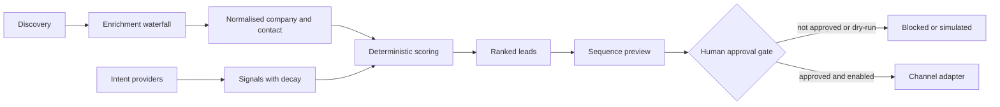

# Outbound Intelligence Engine

> A safety-first TypeScript control plane for turning fragmented company data and buying signals into explainable, human-approved outbound actions.

[](https://github.com/Kazemkhani/outbound-intelligence-engine/actions/workflows/ci.yml)
[](https://github.com/Kazemkhani/outbound-intelligence-engine/actions/workflows/secret-scan.yml)
[](LICENSE)
[](package.json)
[](tsconfig.base.json)

OIE is an open-source reference implementation for AI-native outbound infrastructure. It discovers and enriches prospects, collects dated intent signals, ranks each lead with deterministic code, and prepares multi-channel sequences behind an explicit human approval gate.

The important boundary is deliberate: models may extract and explain; they never compute the score, approve an action, or bypass the send gate.

## Why OIE exists

Most outbound stacks are collections of vendor-specific automations. OIE owns the seams:

- **Explainable ranking.** Fit, time-decayed intent, composite score, tier, and rationale are deterministic and versioned.
- **Replaceable providers.** Every external service maps into stable internal contracts and one normalised model.
- **Default-deny execution.** A real action requires dry-run to be deliberately disabled and that exact action to be approved by a human.
- **Durable orchestration.** Retries, idempotency, suppression, cost ceilings, and multi-day state live in the workflow layer.
- **Operator visibility.** The Next.js control plane exposes the evidence, approval queue, ICP editor, signals, and system health.

## System map



## What is implemented

| Capability      | Implementation                                                                           |
| --------------- | ---------------------------------------------------------------------------------------- |
| Scoring         | Pure TypeScript fit and intent engine with decay, tiering, model versions, and rationale |
| Enrichment      | Cost-bounded waterfall with fill-missing semantics and per-field provenance              |
| Signals         | Multi-provider fan-in, deduplication, strength, timestamps, and central expiry windows   |
| Orchestration   | Inngest workflows, idempotent sequencing, suppression, stop-on-reply, and cost caps      |
| Safety          | Dry-run by default, action-level approval, channel enablement, audit trail, and tests    |
| Control plane   | Next.js dashboard for leads, signals, ICP configuration, approvals, and analytics        |
| Integrations    | Adapters for discovery, enrichment, signals, email, messaging, CRM, LLM, and voice       |
| Agent interface | Read-only MCP server for deterministic scoring; never part of the send path              |

## Quick start

Prerequisites: Node.js 22+, pnpm 10, and Docker for the complete local stack.

```bash
git clone https://github.com/Kazemkhani/outbound-intelligence-engine.git
cd outbound-intelligence-engine
corepack enable
pnpm install --frozen-lockfile
pnpm verify
```

Run the complete local stack:

```bash
cp .env.example .env
pnpm infra:up
pnpm db:migrate
pnpm db:seed
pnpm --filter web dev
```

Open [http://localhost:3000](http://localhost:3000). Provider credentials are optional for builds and tests; recorded fixtures keep CI offline and reproducible.

## Prove the safety rails

These commands use fixtures or dry-run paths. They do not send messages:

```bash
pnpm exec tsx --env-file=.env scripts/gate1-credentials.ts
pnpm exec tsx --env-file=.env scripts/phase4-signals-demo.ts
pnpm exec tsx scripts/phase10-pilot-dryrun.ts
```

The central guarantee is implemented in [`evaluateSendGate`](packages/orchestration/src/send-gate.ts). A channel adapter can be invoked only after the gate returns `allowSend: true`; LinkedIn and WhatsApp require an additional explicit channel-enable condition.

## Repository layout

```text
apps/web/               Next.js operator control plane and API
packages/core/          Domain schemas and deterministic scoring
packages/config/        Environment loading and validation
packages/db/            Prisma model, migrations, client, and seed
packages/integrations/  Vendor adapters and stable internal contracts
packages/orchestration/ Durable workflows, send gate, sequencing, and cost caps
packages/mcp/           Read-only scoring tools over MCP
evals/                  Grounding and behaviour evaluation harness
infra/                  Local Postgres and self-hosting notes
scripts/                Fixture proofs and opt-in operator utilities
docs/                   Architecture and decision records
```

## Engineering invariants

- Scores are produced by pure code, never by an LLM.
- Missing data stays unknown; the system does not invent facts.
- Vendor payloads are validated and normalised at the adapter boundary.
- Every send path passes suppression checks and the central approval gate.
- Secrets come from the environment and are never committed or logged.
- Tests and examples use synthetic data; do not commit prospect PII.

Read the [architecture guide](docs/ARCHITECTURE.md), [decision records](docs/adr/README.md), [operations runbook](RUNBOOK.md), and [security policy](SECURITY.md) before changing a load-bearing boundary.

## Contributing

Issues and pull requests are welcome. Start with [CONTRIBUTING.md](CONTRIBUTING.md), keep changes focused, and include `pnpm verify` evidence. Security reports belong in GitHub's private vulnerability-reporting flow, not a public issue.

## License

Apache License 2.0. See [LICENSE](LICENSE).
