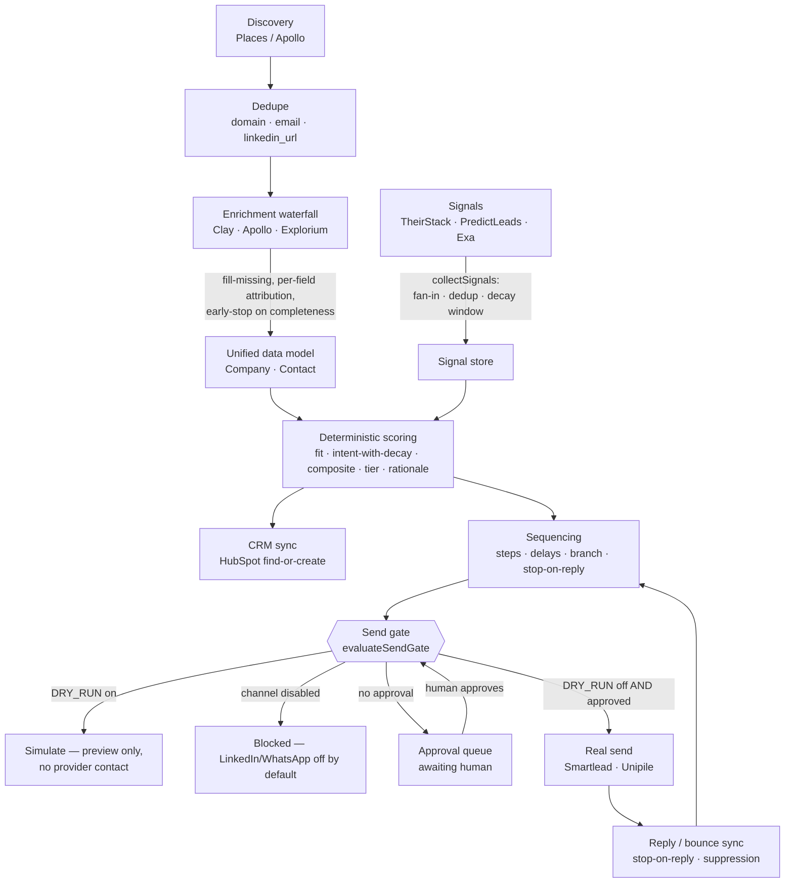

# OIE Architecture

> The Outbound Intelligence Engine (OIE) is a conductor, a brain, and a cockpit over an orchestra of specialist tools. This document explains the system at depth: the core idea, the build-vs-buy split, the five owned pillars, the end-to-end data flow, the module map, the anti-corruption layer and its stable interfaces, the unified data model, and the principle that holds it all together.

Architecture decisions and their rationale are recorded under [`docs/adr/`](./adr/README.md). Supersede a decision with a new ADR instead of rewriting its history.

---

## 1. The core idea — conductor, brain, cockpit

OIE does not try to out-build the best specialist tools on the market. It orchestrates them.

- **Conductor** — a durable workflow engine sequences the bought rails in the right order, with retries, idempotency, deduplication, cost ceilings and a human approval gate.
- **Brain** — a deterministic scoring engine and an LLM personalisation layer turn raw enrichment and intent signals into a ranked, explainable, reviewed action. The LLM extracts and reasons; **code computes the number**.
- **Cockpit** — an operator control plane surfaces ranked leads, the signal feed, an ICP editor with live re-rank, the sequence builder, the approval queue, analytics, and channel and cost health.

The value lives in the **connections between** great tools and in the **intelligence and control** wrapped around them. We never re-implement a tool that a vendor already does better.

### Build vs buy

The single most important architectural decision is what we buy and what we build.

**Buy (integrate — battle-tested, you cannot beat them solo):**

- Multi-provider data and enrichment waterfall (Clay, Apollo, Explorium, Google Places).
- Signal and intent feeds (TheirStack, PredictLeads, Exa).
- Email sending infrastructure — mailbox fleets, warmup, rotation, reputation (Smartlead).
- LinkedIn and WhatsApp messaging rails and unified reply sync (Unipile).
- The CRM system of record (HubSpot).
- Managed auth for agent tool access (Composio / Rube).
- The reasoning, extraction and writing engine (Anthropic Claude).

**Build (own — the differentiation and defensibility):** the five pillars below.

You lose if you try to out-build Clay's enrichment waterfall, Smartlead's deliverability infrastructure, or LinkedIn's messaging rails. Integrate them. Spend engineering on the seams, the intelligence, the control plane, and the experience.

---

## 2. The five owned pillars

Everything OIE builds — and never defers — falls into five pillars.

1. **Orchestration brain** — the durable workflow engine that sequences the bought rails (discovery → enrichment → signals → scoring → CRM → sequencing) with idempotency, retries, deduplication, cost caps and the approval gate. Lives in [`packages/orchestration`](../packages/orchestration/README.md). The waterfall and provider-fallback logic live **here**, in our core, not inside any vendor.
2. **Deterministic ICP scoring and ranking engine** — explainable and unit-tested. Computes fit, intent-with-decay, a composite blend, A/B/C/D tiers and a human-readable rationale. The LLM never computes a score. Lives in [`packages/core`](../packages/core/README.md). See [ADR-0008](./adr/0008-deterministic-scoring-engine.md).
3. **Operator control plane** — ranked leads, signal feed, ICP editor with live re-rank, sequence builder, the approval queue, analytics, and channel, mailbox and cost health. Lives in [`apps/web`](../apps/web/README.md).
4. **Unified data model and anti-corruption adapters** — one normalised source of truth across all providers, so any vendor can be swapped without touching the core. The model lives in [`packages/db`](../packages/db/README.md); the adapters and their stable interfaces live in [`packages/integrations`](../packages/integrations/README.md). See [ADR-0010](./adr/0010-anti-corruption-adapters.md).
5. **Personalisation and signal-action engine** — Claude turns enrichment plus the _specific_ signal into a reviewed, non-generic opener; fresh signals auto-enrol matching leads (through the gate). Lives in `packages/integrations/llm` and `packages/orchestration/enrolment`.

A sixth concern — the **eval and observability layer** (evals for every LLM step, the append-only audit log, and cost and usage tracking) — runs across all five.

The five pillars are load-bearing alongside five engineering standards that are never deferred: **types, error handling, security and secrets, compliance gates, and tests.**

---

## 2.5 Module map

OIE is a pnpm + Turborepo monorepo, organised by **problem domain**, not by technical layer.

```
/apps
  /web                      # Next.js control plane (dashboard) + API
/packages
  /core                     # domain types, Zod schemas, the deterministic scoring engine (pure)
  /db                       # Prisma schema, client, migrations, seed (the unified data model)
  /orchestration            # Inngest functions: pipelines, waterfall logic, schedulers, send gate
  /integrations             # anti-corruption adapters, one per vendor:
      /places /apollo /clay /explorium     # EnrichmentProvider
      /theirstack /predictleads /exa       # SignalProvider
      /smartlead                           # EmailSender
      /unipile                             # MessagingChannel
      /hubspot                             # CrmStore
      /llm                                 # reasoning / personalisation / extraction (never scores)
      /contracts                           # the five stable internal interfaces + unified DTOs
      /base                                # shared HTTP transport, retry, idempotency, error taxonomy
  /config                   # env loading + validation (fail fast on missing keys)
/infra                      # docker-compose (Postgres), deployment notes
/scripts                    # evidence scripts (credentials gate, signal demo, pilot dry-run)
```

Dependency direction is strict and acyclic:

```
config        (no internal deps)
core          (no internal deps)
db            → core
integrations  → core
orchestration → core, db, integrations
web           → core, db, orchestration
```

`core` and `config` sit at the base and depend on nothing internal. Vendor shapes only exist inside an adapter folder; nothing downstream of `integrations/contracts` ever sees a vendor payload.

---

## 3. Data flow — discovery to send gate

The pipeline runs as durable Inngest steps. Every send-path branch terminates at the **send gate** and, when a real send would occur, the **approval queue**.



Key invariants visible in this flow:

- **The waterfall is ours.** Priority order, fill-missing with per-field provider attribution, early-stop once a record is complete (a cost ceiling), fall-through on error, and skipping unconfigured providers all live in `enrichCompanyWaterfall` in our orchestration core — not in any vendor.
- **Signals decay.** `collectSignals` performs cross-provider and re-pull deduplication (keep-stronger) and assigns a central decay window. Intent is computed from signal strength with linear decay, so stale signals stop moving the score.
- **Code computes the number.** Scoring is pure and deterministic; `now` is injected, never read from the clock.
- **Nothing sends without two independent conditions.** `evaluateSendGate` requires both `DRY_RUN` off **and** an explicit per-action human approval. LinkedIn and WhatsApp carry a third gate: the channel must be explicitly enabled (off by default). See [ADR-0009](./adr/0009-send-gate-and-dry-run.md).

---

## 4. The anti-corruption layer and the five stable interfaces

Every bought rail is wrapped in an adapter under `packages/integrations/<vendor>`. An adapter:

- implements a **stable internal interface** (one of the five below);
- translates vendor payloads to and from the **unified data model** so vendor shapes never leak into the core;
- owns its auth, rate-limit handling, retries, idempotency keys, error taxonomy and **cost accounting**;
- is covered by integration tests against **recorded fixtures** — no live calls in CI.

The cascade, the cost ceiling and the swap are **ours**. An adapter only ever knows its own vendor. Swapping a provider must not touch the core — only its adapter.

The five interfaces (defined in [`packages/integrations/src/contracts/interfaces.ts`](../packages/integrations/src/contracts/interfaces.ts)):

| Interface            | Purpose                                                        | Implemented by                  |
| -------------------- | -------------------------------------------------------------- | ------------------------------- |
| `EnrichmentProvider` | discovery + company/contact enrichment                         | Places, Apollo, Clay, Explorium |
| `SignalProvider`     | buying signals / intent                                        | TheirStack, PredictLeads, Exa   |
| `EmailSender`        | email sending infrastructure (honours `ctx.dryRun`)            | Smartlead                       |
| `MessagingChannel`   | authenticated LinkedIn / WhatsApp rails (honours `ctx.dryRun`) | Unipile                         |
| `CrmStore`           | CRM system of record, find-or-create                           | HubSpot                         |

Each interface exposes `isConfigured()`, which reports whether the vendor's credentials are present and drives the live-versus-fixture path. Send-capable interfaces (`EmailSender`, `MessagingChannel`) must honour `ctx.dryRun` — in dry-run they produce a preview and never contact the provider.

The LLM client is deliberately **not** one of these interfaces. It reasons, extracts and writes; it never computes a score and never sits on the production send path.

### MCP vs REST — a load-bearing distinction

- **MCP** is for agents at runtime and for build-time exploration — interactive, conversational, one-off, with managed auth.
- **REST and webhooks** are the production pipeline — high-throughput, idempotent, observable.
- **Rule:** never put the production send-path behind an interactive MCP call. See [ADR-0002](./adr/0002-inngest-orchestration.md).

---

## 5. The unified data model

One normalised model is the single source of truth across all providers. Adapters translate vendor payloads into the normalised DTOs (`NormalisedCompany`, `NormalisedContact`, `NormalisedSignal`) defined in [`packages/integrations/src/contracts/model.ts`](../packages/integrations/src/contracts/model.ts); the persistence schema lives in [`packages/db/prisma/schema.prisma`](../packages/db/prisma/schema.prisma).

Core entities:

| Entity           | Role                                                                                                | Dedupe / uniqueness                |
| ---------------- | --------------------------------------------------------------------------------------------------- | ---------------------------------- |
| `IcpProfile`     | versioned ICP definition (firmographics, technographics, people, signals, weights, tier thresholds) | —                                  |
| `Company`        | normalised company, with `sources` JSON recording which provider supplied which field               | `domain` (+ `placeId`)             |
| `Contact`        | normalised person tied to a company                                                                 | `email` / `linkedinUrl`            |
| `Signal`         | a dated intent signal with strength, evidence, `detectedAt` and `expiresAt` (decay)                 | `signalDedupeKey`                  |
| `Score`          | fit, intent, composite, tier, rationale, model version, computed-at                                 | recomputed on ICP change           |
| `Sequence`       | a cadence: steps (channel, delay, template, conditions), status                                     | —                                  |
| `Enrolment`      | a contact in a sequence                                                                             | unique (`contactId`, `sequenceId`) |
| `Message`        | a per-step activity with channel, direction and status                                              | `idempotencyKey`                   |
| `Mailbox`        | a Smartlead sending mailbox with daily limit, warmup and health                                     | —                                  |
| `ChannelAccount` | a Unipile LinkedIn/WhatsApp account, off by default, with weekly connect limit                      | —                                  |
| `Suppression`    | an email/domain never to be contacted                                                               | —                                  |
| `AuditLog`       | append-only record of every actor/action/entity                                                     | —                                  |
| `ProviderCost`   | per-provider, per-task spend                                                                        | —                                  |

Field provenance is always recorded in `sources` (field name → provider name), so we always know which provider supplied which field — essential for trust, debugging and provider swap.

---

## 6. The principle of seams

> The value is in the connections between great tools and in the intelligence and control wrapped around them — never in re-implementing any single tool.

This principle decides every trade-off in OIE:

- When a vendor does something well, we **integrate** it behind an adapter and spend our effort on the seam — the cascade logic, the cost ceiling, the normalisation, the swap.
- When a decision is our differentiation — what counts as a good lead, what to say, when to send, whether to send at all — we **own** it in code we can test, explain and trust.
- Because the seams are clean and the interfaces are stable, any vendor can be replaced by writing one adapter. No vendor can hold the system hostage.

The send gate is the sharpest seam of all: it is the one place where automation stops and a human decides. It is enforced in code, not in a remembered instruction, and it is never weakened.

---

## Architecture Decision Records

All locked decisions are recorded as ADRs. See the [ADR index](./adr/README.md). The load-bearing ones:

- [ADR-0001 — TypeScript monorepo](./adr/0001-typescript-monorepo.md)
- [ADR-0002 — Inngest orchestration](./adr/0002-inngest-orchestration.md)
- [ADR-0003 — Clay + Apollo + Explorium enrichment](./adr/0003-clay-apollo-explorium-enrichment.md)
- [ADR-0004 — TheirStack + PredictLeads + Exa signals](./adr/0004-theirstack-predictleads-exa-signals.md)
- [ADR-0005 — Smartlead email](./adr/0005-smartlead-email.md)
- [ADR-0006 — Unipile LinkedIn + WhatsApp](./adr/0006-unipile-linkedin-whatsapp.md)
- [ADR-0007 — HubSpot CRM](./adr/0007-hubspot-crm.md)
- [ADR-0008 — Deterministic scoring engine](./adr/0008-deterministic-scoring-engine.md)
- [ADR-0009 — Send gate and dry-run](./adr/0009-send-gate-and-dry-run.md)
- [ADR-0010 — Anti-corruption adapters](./adr/0010-anti-corruption-adapters.md)
